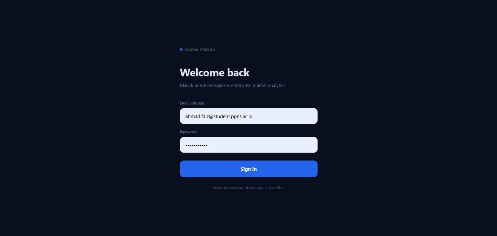
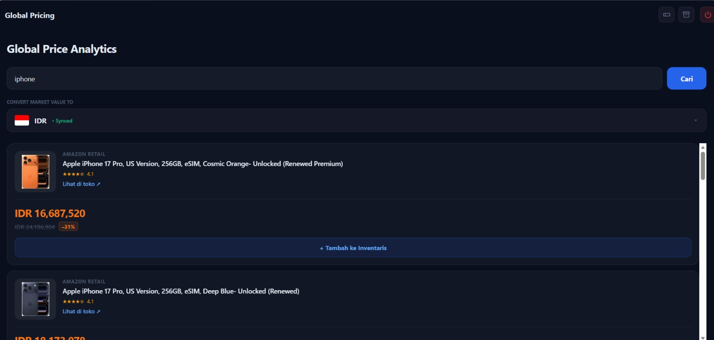
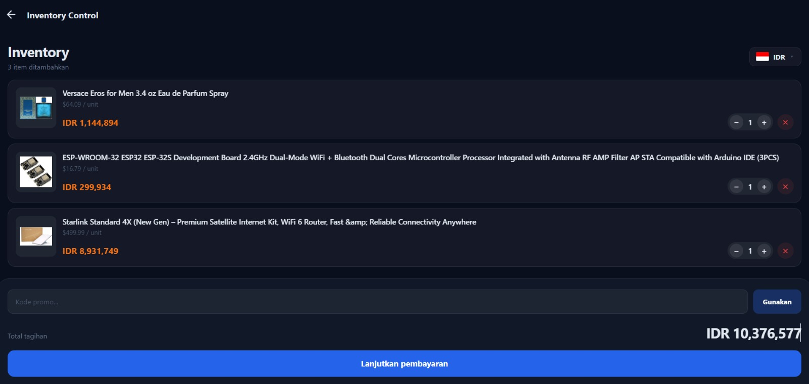
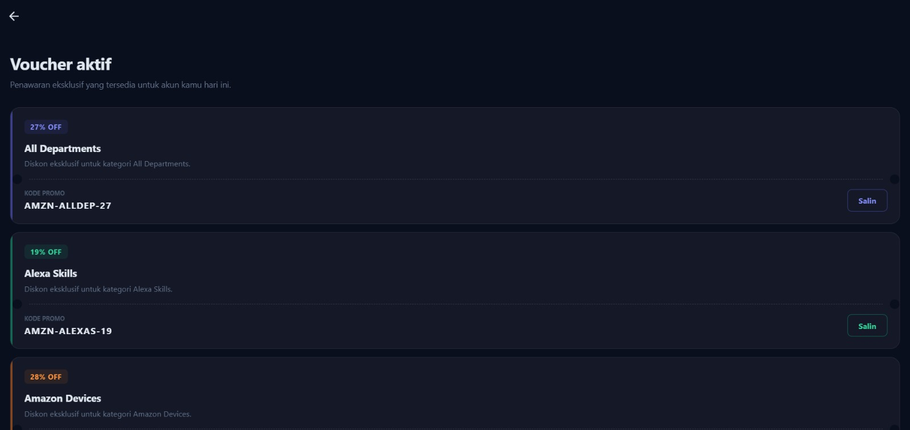

# 🛒 Global Pricing App
> Aplikasi mobile React Native untuk cek harga produk Amazon secara realtime, konversi ke 160+ mata uang global, dan manajemen inventaris berbasis cloud.


---

## 👥 Anggota Tim & Pembagian Tugas

| No | Nama | NRP | Peran | Tanggung Jawab |
|----|------|-----|-------|----------------|
| 1 | **[Ahmad Faiz Zuhdi]** | [0923040080] | Frontend & Axios Specialist | UI/UX seluruh aplikasi, integrasi Axios ke Amazon API & ExchangeRate API, CurrencyContext, SearchScreen, PromoScreen, ExchangeRateScreen |
| 2 | **[Mochammad Ravi]** | [0923040071] | Backend, State & Firebase Specialist | Firebase Auth (login/logout/session), Firestore realtime database, AuthContext, ShoppingListScreen, konfigurasi firebase.ts |

---

## 📱 Deskripsi Aplikasi

**Global Pricing App** adalah aplikasi mobile yang memungkinkan pengguna untuk:
- Mencari dan membandingkan harga produk dari Amazon marketplace secara realtime
- Mengkonversi harga ke lebih dari **160 mata uang** dunia secara otomatis
- Menyimpan produk ke dalam **inventory** berbasis cloud (Firestore)
- Mendapatkan dan menggunakan **kode promo** dari kategori produk Amazon
- Melihat **tabel kurs** lengkap dengan harga beli/jual simulasi bank

---

## ✨ 3 Fitur Utama (Demo)

### Fitur 1 — Global Product Search *(Ahmad Faiz Zuhdi)*
Pencarian produk Amazon secara realtime menggunakan Axios. Hasil ditampilkan dengan harga yang otomatis dikonversi ke mata uang pilihan user. Mendukung **infinite scroll** (pagination) dan tombol langsung ke halaman produk asli.

**Teknologi:** Axios · Amazon RapidAPI · `Intl.NumberFormat` · FlatList infinite scroll

### Fitur 2 — Promo & Voucher Center *(Ahmad Faiz Zuhdi)*
Menampilkan voucher promo yang di-generate dari daftar kategori produk Amazon API. Setiap voucher memiliki kode unik format `AMZN-XXXXX-XX` yang bisa disalin dan digunakan di halaman Inventory untuk mendapat diskon.

**Teknologi:** Axios · Amazon Category API · RefreshControl · Alert

### Fitur 3 — Inventory Control & Checkout *(Mochammad Ravi)*
Manajemen keranjang belanja berbasis **Firestore realtime**. Mendukung update quantity, hapus item, input kode promo, kalkulasi grand total dengan diskon, dan cetak e-invoice (PDF/Print).

**Teknologi:** Firebase Firestore · `onSnapshot` realtime listener · expo-print

---

## 🔌 Daftar API yang Digunakan

| API | Endpoint | Kegunaan | Library |
|-----|----------|----------|---------|
| **Amazon Real-Time Data** | `real-time-amazon-data.p.rapidapi.com` | Search produk & kategori Amazon | Axios via RapidAPI |
| **Open Exchange Rates** | `open.er-api.com/v6/latest/USD` | Kurs 160+ mata uang global (USD base) | Axios |
| **Flag CDN** | `flagcdn.com/w160/{code}.png` | Gambar bendera mata uang | Fetch URL |

---

## 🛠️ Tech Stack

```
React Native (Expo)     → Framework mobile cross-platform
TypeScript              → Type safety
React Navigation v6     → Stack navigation + modal
Axios                   → HTTP client untuk semua API request
Firebase Auth           → Autentikasi email/password
Cloud Firestore         → Realtime database (NoSQL)
React Context API       → Global state management
expo-print              → Cetak e-invoice dari HTML
react-native-svg        → Icon SVG kustom
Intl.NumberFormat       → Format harga multi-currency
```

---

## 📁 Struktur Proyek

```
my-shopping-app/
├── App.tsx                          ← Root: Provider hierarchy + Navigator + Auth Guard
├── src/
│   ├── context/
│   │   ├── AuthContext.tsx          ← Firebase Auth state (login/logout/session)
│   │   └── CurrencyContext.tsx      ← Kurs global + format harga dinamis
│   ├── screens/
│   │   ├── LoginScreen.tsx          ← Halaman login (Firebase Auth)
│   │   ├── SearchScreen.tsx         ← Search produk + add to inventory
│   │   ├── ShoppingListScreen.tsx   ← Inventory + promo code + checkout
│   │   ├── PromoScreen.tsx          ← Voucher dari Amazon Category API
│   │   └── ExchangeRateScreen.tsx   ← Tabel 160+ kurs global
│   ├── services/
│   │   ├── api.ts                   ← Semua Axios calls (Amazon + ExchangeRate)
│   │   └── firebase.ts              ← Inisialisasi Firebase (Auth + Firestore)
│   └── utils/
│       └── generateInvoiceHTML.ts   ← Template HTML untuk e-invoice
└── package.json
```

---

## 🚀 Cara Menjalankan

### Prerequisites
- Node.js ≥ 18
- Expo CLI (`npm install -g expo-cli`)
- Akun Firebase (untuk konfigurasi)

### Instalasi

```bash
# 1. Clone repository
git clone https://github.com/[username]/my-shopping-app.git
cd my-shopping-app

# 2. Install dependencies
npm install

# 3. Jalankan aplikasi
npx expo start
```

### Konfigurasi Firebase

Ganti nilai di `src/services/firebase.ts` dengan config dari Firebase Console anda:

```typescript
const firebaseConfig = {
  apiKey:            "YOUR_API_KEY",
  authDomain:        "YOUR_PROJECT.firebaseapp.com",
  projectId:         "YOUR_PROJECT_ID",
  storageBucket:     "YOUR_PROJECT.firebasestorage.app",
  messagingSenderId: "YOUR_SENDER_ID",
  appId:             "YOUR_APP_ID"
};
```

---

## 🔐 Firebase Security Rules (Firestore)

```javascript
rules_version = '2';
service cloud.firestore {
  match /databases/{database}/documents {
    // Hanya user yang sudah login bisa baca/tulis shopping_lists
    match /shopping_lists/{document} {
      allow read, write: if request.auth != null;
    }
  }
}
```

---
## 📸 Screenshots
| Login | 
| Search | 
| Inventory | 
| Promo | 

## 📋 Komponen Penilaian

| Komponen | Bobot | Implementasi |
|----------|-------|--------------|
| Implementasi Axios | 25% | `api.ts` — axios.create(), searchProducts(), getGlobalExchangeRates() |
| Implementasi Firebase | 25% | Auth (signIn/signOut/onAuthStateChanged) + Firestore (onSnapshot, addDoc, updateDoc) |
| UI/UX & Kerapian Kode | 15% | Dark enterprise theme, TypeScript strict, Context API |
| Kerja sama & Git Log | 15% | Commit terpisah per anggota sesuai pembagian tugas |
| Penguasaan Materi / Demo | 20% | Demo 3 fitur utama + Q&A individual |

---

## 📄 Lisensi

Proyek ini dibuat untuk keperluan Ujian Praktikum Mobile Computing — Semester Genap 2025/2026  
Politeknik Perkapalan Negeri Surabaya (PPNS)
